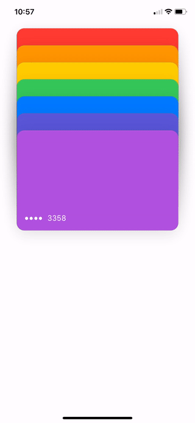
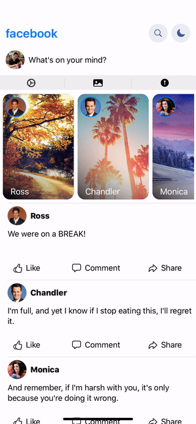

# SwiftUIAnimation
SwiftUI Tutorial and References

# OVERVIEW
Recreation of some cool animations. 
* Apple Wallet animations
* Facebook Homescreen with Extending Searchbar + Toggle Light/Dark Mode

This is a work in progress and will be updated for major bugs and UI problems. Ideal device would be iPhone XR or 11. I didn’t test this on other devices since I just wanted to practice. Updates for those will come soon. 

Goal is to share this with the community and be used as reference for future projects. I would also love to get some feedback on better implementations. Hope you guys find this useful. A good resource that was very helpful to me was MengTo's DesignCode. 

        

# Usage

# Requirements
• Xcode 11

• Swift 5

• Simulations should be used on iPhone Xr or 11 
